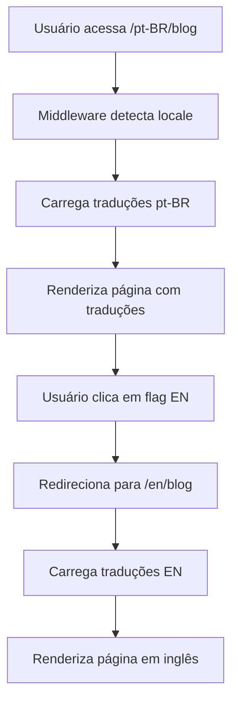

# 🌍 Visão Geral da Internacionalização

## 🎯 Objetivo

Implementar um sistema completo de internacionalização para o portfolio, suportando:

- 🇺🇸 **Inglês (en)** - Idioma principal
- 🇧🇷 **Português (pt-BR)** - Idioma secundário
- 🇳🇱 **Holandês (nl)** - Idioma terciário

## 🏗️ Arquitetura Escolhida

### **Next.js App Router + next-intl**

**Por que esta combinação?**

✅ **Vantagens:**

- URLs com locale: `/en/blog`, `/pt-BR/projects`
- SEO otimizado com meta tags específicas
- Geração estática para todos os idiomas
- Type safety com TypeScript
- Performance superior com cache inteligente
- Detecção automática do idioma do navegador

❌ **Alternativas consideradas:**

- `react-i18next`: Mais complexo para App Router
- `next-translate`: Menos recursos avançados
- Context API manual: Muito código boilerplate

## 🔄 Fluxo de Funcionamento



## 📊 Estrutura de URLs

| Idioma    | URL Base | Exemplo           |
| --------- | -------- | ----------------- |
| Inglês    | `/en`    | `/en/blog`        |
| Português | `/pt-BR` | `/pt-BR/projects` |
| Holandês  | `/nl`    | `/nl/contact`     |

## 🎨 Componentes Afetados

- ✅ **Navbar**: Seletor de idioma funcional
- ✅ **Páginas**: Todas as páginas principais
- ✅ **Blog**: Posts e categorias
- ✅ **Projetos**: Detalhes e listagem
- ✅ **Formulários**: Labels e mensagens
- ✅ **Meta tags**: SEO multilíngue

## 🔧 Configurações Técnicas

### **Dependências**

```json
{
  "next-intl": "^3.0.0"
}
```

### **Configurações**

- Middleware para roteamento
- Configuração de locales
- Arquivos de tradução JSON
- Hooks personalizados

## 📈 Benefícios Esperados

1. **SEO**: Melhor indexação por idioma
2. **UX**: Experiência localizada
3. **Performance**: Cache otimizado
4. **Manutenibilidade**: Código organizado
5. **Escalabilidade**: Fácil adição de idiomas

## 🎯 Estratégia de Implementação

### **Fase 1: Configuração Base**

- Instalação de dependências
- Configuração do middleware
- Estrutura de pastas

### **Fase 2: Migração de Páginas**

- Mover páginas para `[locale]`
- Adaptar componentes
- Criar layouts específicos

### **Fase 3: Traduções**

- Criar arquivos de tradução
- Implementar hooks
- Testar funcionalidade

### **Fase 4: Otimização**

- SEO multilíngue
- Performance
- Testes finais

## 🔍 Considerações Importantes

### **SEO**

- URLs específicas por idioma
- Meta tags localizadas
- Sitemap multilíngue
- Hreflang tags

### **Performance**

- Geração estática
- Cache inteligente
- Lazy loading de traduções
- Otimização de bundle

### **UX**

- Detecção automática de idioma
- Persistência da escolha
- Transições suaves
- Feedback visual

### **Manutenibilidade**

- Estrutura organizada
- Traduções centralizadas
- Type safety
- Documentação clara
