# 📝 Integração Next.js + Obsidian

## 🎯 Visão Geral

Esta documentação detalha como integrar o **Obsidian** como backend para o blog do portfolio, criando um sistema de gerenciamento de conteúdo baseado em arquivos Markdown.

## 🏗️ Arquitetura Proposta

### **Fluxo de Funcionalidade**

```mermaid
graph TD
    A[Obsidian Vault] --> B[Arquivos Markdown]
    B --> C[Next.js File System API]
    C --> D[Processamento de Frontmatter]
    D --> E[Geração de Páginas Estáticas]
    E --> F[Blog Multilíngue]

    G[Editor Obsidian] --> H[Plugin Personalizado]
    H --> I[Metadados Automáticos]
    I --> J[Organização por Tags]
    J --> K[Sistema de Categorias]
```



## 📁 Estrutura do Vault Obsidian

### **Organização de Pastas**

```
portfolio-vault/
├── 📁 blog/
│   ├── 📁 en/
│   │   ├── 📄 getting-started-with-nextjs.md
│   │   ├── 📄 building-multilingual-apps.md
│   │   └── 📄 optimizing-performance.md
│   ├── 📁 pt-BR/
│   │   ├── 📄 comecando-com-nextjs.md
│   │   ├── 📄 construindo-apps-multilingues.md
│   │   └── 📄 otimizando-performance.md
│   └── 📁 nl/
│       ├── 📄 beginnen-met-nextjs.md
│       ├── 📄 meertalige-apps-bouwen.md
│       └── 📄 prestaties-optimaliseren.md
├── 📁 assets/
│   ├── 📁 images/
│   ├── 📁 attachments/
│   └── 📁 media/
├── 📁 templates/
│   ├── 📄 blog-post-template.md
│   └── 📄 project-template.md
└── 📁 config/
    ├── 📄 categories.json
    ├── 📄 tags.json
    └── 📄 metadata.json
```

## 🔧 Configuração do Obsidian

### **Plugins Essenciais**

#### **1. Templater**

```javascript
// templates/blog-post-template.md
---
title: "{{title}}"
slug: "{{slug}}"
date: "{{date}}"
author: "Carlos S. Cantanzaro"
category: "{{category}}"
tags: ["{{tags}}"]
language: "{{language}}"
excerpt: "{{excerpt}}"
featured: false
draft: false
---

# {{title}}

{{excerpt}}

<!-- content starts here -->
```

#### **2. Dataview**

```dataview
TABLE
  title as "Title",
  date as "Date",
  category as "Category",
  language as "Language"
FROM "blog"
WHERE language = "en"
SORT date DESC
```

#### **3. Calendar**

- Visualização de posts por data
- Planejamento de conteúdo
- Tracking de publicação

### **Configuração de Hotkeys**

```json
{
  "new-blog-post": "Ctrl+Shift+B",
  "new-project": "Ctrl+Shift+P",
  "insert-template": "Ctrl+Shift+T",
  "publish-post": "Ctrl+Shift+Enter"
}
```

## 📝 Estrutura de Frontmatter

### **Frontmatter Padrão**

```yaml
---
title: "Getting Started with Next.js 15"
slug: "getting-started-with-nextjs-15"
date: "2024-01-15"
updated: "2024-01-20"
author: "Carlos S. Cantanzaro"
author_image: "/images/authors/carlos.jpg"
category: "Development"
tags: ["nextjs", "react", "tutorial", "beginners"]
language: "en"
excerpt: "Learn how to build modern web applications with Next.js 15 and React 19"
featured: true
draft: false
reading_time: 8
difficulty: "beginner"
series: "Next.js Mastery"
series_order: 1
seo_title: "Next.js 15 Tutorial for Beginners - Complete Guide"
seo_description: "Master Next.js 15 with this comprehensive tutorial. Learn React 19, App Router, and build production-ready applications."
og_image: "/images/blog/nextjs-15-guide.jpg"
twitter_image: "/images/blog/nextjs-15-guide-twitter.jpg"
canonical_url: "https://carloscantanzaro.com/en/blog/getting-started-with-nextjs-15"
related_posts:
  ["react-19-features", "app-router-guide", "performance-optimization"]
---
```

### **Frontmatter Multilíngue**

```yaml
# en/getting-started-with-nextjs.md
---
title: "Getting Started with Next.js 15"
slug: "getting-started-with-nextjs-15"
translations:
  pt-BR: "comecando-com-nextjs-15"
  nl: "beginnen-met-nextjs-15"
---
# pt-BR/comecando-com-nextjs.md
---
title: "Começando com Next.js 15"
slug: "comecando-com-nextjs-15"
translations:
  en: "getting-started-with-nextjs-15"
  nl: "beginnen-met-nextjs-15"
---
# nl/beginnen-met-nextjs.md
---
title: "Beginnen met Next.js 15"
slug: "beginnen-met-nextjs-15"
translations:
  en: "getting-started-with-nextjs-15"
  pt-BR: "comecando-com-nextjs-15"
---
```

## 🔌 Integração com Next.js

### **1. Sistema de Leitura de Arquivos**

```typescript:lib/obsidian-blog.ts
import fs from 'fs';
import path from 'path';
import matter from 'gray-matter';
import { remark } from 'remark';
import html from 'remark-html';
import prism from 'remark-prism';

const VAULT_PATH = process.env.OBSIDIAN_VAULT_PATH || './portfolio-vault';
const BLOG_PATH = path.join(VAULT_PATH, 'blog');

export interface BlogPost {
  id: string;
  title: string;
  slug: string;
  date: string;
  updated?: string;
  author: string;
  author_image?: string;
  category: string;
  tags: string[];
  language: string;
  excerpt: string;
  content: string;
  featured: boolean;
  draft: boolean;
  reading_time: number;
  difficulty: 'beginner' | 'intermediate' | 'advanced';
  series?: string;
  series_order?: number;
  seo_title?: string;
  seo_description?: string;
  og_image?: string;
  twitter_image?: string;
  canonical_url?: string;
  related_posts?: string[];
  translations?: Record<string, string>;
}

export async function getAllBlogPosts(language?: string): Promise<BlogPost[]> {
  const posts: BlogPost[] = [];

  // Ler todos os diretórios de idioma
  const languageDirs = fs.readdirSync(BLOG_PATH);

  for (const langDir of languageDirs) {
    const langPath = path.join(BLOG_PATH, langDir);

    // Filtrar por idioma se especificado
    if (language && langDir !== language) continue;

    if (fs.statSync(langPath).isDirectory()) {
      const files = fs.readdirSync(langPath);

      for (const file of files) {
        if (file.endsWith('.md')) {
          const post = await getBlogPostBySlug(file.replace('.md', ''), langDir);
          if (post && !post.draft) {
            posts.push(post);
          }
        }
      }
    }
  }

  return posts.sort((a, b) => new Date(b.date).getTime() - new Date(a.date).getTime());
}

export async function getBlogPostBySlug(slug: string, language: string): Promise<BlogPost | null> {
  const filePath = path.join(BLOG_PATH, language, `${slug}.md`);

  if (!fs.existsSync(filePath)) {
    return null;
  }

  const fileContents = fs.readFileSync(filePath, 'utf8');
  const { data, content } = matter(fileContents);

  // Processar Markdown para HTML
  const processedContent = await remark()
    .use(html)
    .use(prism)
    .process(content);

  const contentHtml = processedContent.toString();

  // Calcular tempo de leitura
  const readingTime = Math.ceil(content.split(' ').length / 200);

  return {
    id: `${language}-${slug}`,
    slug,
    language,
    content: contentHtml,
    reading_time: readingTime,
    ...data,
  } as BlogPost;
}

export async function getBlogPostsByCategory(category: string, language: string): Promise<BlogPost[]> {
  const posts = await getAllBlogPosts(language);
  return posts.filter(post => post.category.toLowerCase() === category.toLowerCase());
}

export async function getBlogPostsByTag(tag: string, language: string): Promise<BlogPost[]> {
  const posts = await getAllBlogPosts(language);
  return posts.filter(post => post.tags.includes(tag));
}

export async function getRelatedPosts(post: BlogPost, limit: number = 3): Promise<BlogPost[]> {
  const posts = await getAllBlogPosts(post.language);

  // Filtrar posts relacionados por categoria e tags
  const related = posts
    .filter(p => p.id !== post.id)
    .filter(p =>
      p.category === post.category ||
      p.tags.some(tag => post.tags.includes(tag))
    )
    .slice(0, limit);

  return related;
}

export async function getCategories(language: string): Promise<string[]> {
  const posts = await getAllBlogPosts(language);
  const categories = [...new Set(posts.map(post => post.category))];
  return categories.sort();
}

export async function getTags(language: string): Promise<string[]> {
  const posts = await getAllBlogPosts(language);
  const tags = [...new Set(posts.flatMap(post => post.tags))];
  return tags.sort();
}
```

### **2. API Routes para Dados Dinâmicos**

```typescript:app/api/blog/posts/route.ts
import { NextRequest, NextResponse } from 'next/server';
import { getAllBlogPosts } from '@/lib/obsidian-blog';

export async function GET(request: NextRequest) {
  const { searchParams } = new URL(request.url);
  const language = searchParams.get('language');
  const category = searchParams.get('category');
  const tag = searchParams.get('tag');
  const featured = searchParams.get('featured');

  try {
    let posts = await getAllBlogPosts(language || undefined);

    if (category) {
      posts = posts.filter(post => post.category.toLowerCase() === category.toLowerCase());
    }

    if (tag) {
      posts = posts.filter(post => post.tags.includes(tag));
    }

    if (featured === 'true') {
      posts = posts.filter(post => post.featured);
    }

    return NextResponse.json({
      posts,
      total: posts.length,
      language,
      category,
      tag,
      featured
    });
  } catch (error) {
    return NextResponse.json(
      { error: 'Failed to fetch blog posts' },
      { status: 500 }
    );
  }
}
```

```typescript:app/api/blog/posts/[slug]/route.ts
import { NextRequest, NextResponse } from 'next/server';
import { getBlogPostBySlug, getRelatedPosts } from '@/lib/obsidian-blog';

export async function GET(
  request: NextRequest,
  { params }: { params: { slug: string } }
) {
  const { searchParams } = new URL(request.url);
  const language = searchParams.get('language') || 'en';

  try {
    const post = await getBlogPostBySlug(params.slug, language);

    if (!post) {
      return NextResponse.json(
        { error: 'Post not found' },
        { status: 404 }
      );
    }

    const relatedPosts = await getRelatedPosts(post);

    return NextResponse.json({
      post,
      relatedPosts,
      language
    });
  } catch (error) {
    return NextResponse.json(
      { error: 'Failed to fetch blog post' },
      { status: 500 }
    );
  }
}
```

### **3. Páginas do Blog**

```typescript:app/[locale]/blog/page.tsx
import { Metadata } from 'next';
import { getTranslations } from 'next-intl/server';
import { getAllBlogPosts, getCategories, getTags } from '@/lib/obsidian-blog';
import { BlogCard } from '@/components/blog-card';
import { CategoryFilter } from '@/components/category-filter';
import { TagCloud } from '@/components/tag-cloud';

interface BlogPageProps {
  params: { locale: string };
  searchParams: {
    category?: string;
    tag?: string;
    featured?: string;
  };
}

export async function generateMetadata({ params }: BlogPageProps): Promise<Metadata> {
  const t = await getTranslations();

  return {
    title: `${t('blog.title')} - Carlos S. Cantanzaro`,
    description: t('blog.description'),
    openGraph: {
      title: t('blog.title'),
      description: t('blog.description'),
      type: 'website',
    },
  };
}

export default async function BlogPage({ params, searchParams }: BlogPageProps) {
  const t = await getTranslations();
  const { locale } = params;
  const { category, tag, featured } = searchParams;

  // Buscar posts com filtros
  let posts = await getAllBlogPosts(locale);

  if (category) {
    posts = posts.filter(post => post.category.toLowerCase() === category.toLowerCase());
  }

  if (tag) {
    posts = posts.filter(post => post.tags.includes(tag));
  }

  if (featured === 'true') {
    posts = posts.filter(post => post.featured);
  }

  const categories = await getCategories(locale);
  const tags = await getTags(locale);

  return (
    <div className="container mx-auto px-4 py-8">
      <div className="text-center mb-12">
        <h1 className="text-4xl font-bold mb-4">
          {t('blog.title')}
        </h1>
        <p className="text-gray-600 max-w-2xl mx-auto">
          {t('blog.description')}
        </p>
      </div>

      <div className="grid grid-cols-1 lg:grid-cols-4 gap-8">
        {/* Sidebar */}
        <aside className="lg:col-span-1">
          <CategoryFilter
            categories={categories}
            currentCategory={category}
            language={locale}
          />
          <TagCloud
            tags={tags}
            currentTag={tag}
            language={locale}
          />
        </aside>

        {/* Posts Grid */}
        <main className="lg:col-span-3">
          {posts.length > 0 ? (
            <div className="grid grid-cols-1 md:grid-cols-2 gap-6">
              {posts.map((post) => (
                <BlogCard key={post.id} post={post} />
              ))}
            </div>
          ) : (
            <div className="text-center py-12">
              <p className="text-gray-500 text-lg">
                {t('blog.noPosts')}
              </p>
            </div>
          )}
        </main>
      </div>
    </div>
  );
}
```

```typescript:app/[locale]/blog/[slug]/page.tsx
import { Metadata } from 'next';
import { notFound } from 'next/navigation';
import { getBlogPostBySlug, getRelatedPosts } from '@/lib/obsidian-blog';
import { BlogPost } from '@/components/blog-post';
import { RelatedPosts } from '@/components/related-posts';
import { ShareButtons } from '@/components/share-buttons';

interface BlogPostPageProps {
  params: {
    locale: string;
    slug: string;
  };
}

export async function generateMetadata({ params }: BlogPostPageProps): Promise<Metadata> {
  const post = await getBlogPostBySlug(params.slug, params.locale);

  if (!post) {
    return {
      title: 'Post not found',
    };
  }

  return {
    title: post.seo_title || post.title,
    description: post.seo_description || post.excerpt,
    openGraph: {
      title: post.title,
      description: post.excerpt,
      type: 'article',
      publishedTime: post.date,
      authors: [post.author],
      images: post.og_image ? [post.og_image] : [],
    },
    twitter: {
      card: 'summary_large_image',
      title: post.title,
      description: post.excerpt,
      images: post.twitter_image ? [post.twitter_image] : [],
    },
  };
}

export default async function BlogPostPage({ params }: BlogPostPageProps) {
  const { locale, slug } = params;

  const post = await getBlogPostBySlug(slug, locale);

  if (!post) {
    notFound();
  }

  const relatedPosts = await getRelatedPosts(post);

  return (
    <article className="container mx-auto px-4 py-8 max-w-4xl">
      <BlogPost post={post} />

      <ShareButtons post={post} />

      {relatedPosts.length > 0 && (
        <RelatedPosts posts={relatedPosts} />
      )}
    </article>
  );
}
```

## 🎨 Componentes do Blog

### **BlogCard Component**

```typescript:components/blog-card.tsx
"use client";

import Link from 'next/link';
import Image from 'next/image';
import { useLocale } from 'next-intl';
import { Badge } from './ui/badge';
import { Card, CardContent, CardHeader } from './ui/card';
import { Calendar, Clock, User } from 'lucide-react';

interface BlogCardProps {
  post: {
    id: string;
    title: string;
    slug: string;
    excerpt: string;
    date: string;
    author: string;
    author_image?: string;
    category: string;
    tags: string[];
    featured: boolean;
    reading_time: number;
    og_image?: string;
  };
}

export function BlogCard({ post }: BlogCardProps) {
  const locale = useLocale();

  return (
    <Card className="h-full hover:shadow-lg transition-shadow">
      <Link href={`/${locale}/blog/${post.slug}`}>
        {post.og_image && (
          <div className="relative h-48 overflow-hidden rounded-t-lg">
            <Image
              src={post.og_image}
              alt={post.title}
              fill
              className="object-cover hover:scale-105 transition-transform"
            />
            {post.featured && (
              <Badge className="absolute top-2 left-2 bg-primary">
                Featured
              </Badge>
            )}
          </div>
        )}

        <CardHeader>
          <div className="flex items-center gap-2 text-sm text-gray-500 mb-2">
            <Calendar className="w-4 h-4" />
            <span>{new Date(post.date).toLocaleDateString()}</span>
            <Clock className="w-4 h-4 ml-2" />
            <span>{post.reading_time} min read</span>
          </div>

          <h2 className="text-xl font-bold hover:text-primary transition-colors">
            {post.title}
          </h2>
        </CardHeader>

        <CardContent>
          <p className="text-gray-600 mb-4 line-clamp-3">
            {post.excerpt}
          </p>

          <div className="flex items-center justify-between">
            <div className="flex items-center gap-2">
              {post.author_image && (
                <Image
                  src={post.author_image}
                  alt={post.author}
                  width={24}
                  height={24}
                  className="rounded-full"
                />
              )}
              <span className="text-sm text-gray-500">{post.author}</span>
            </div>

            <Badge variant="secondary">
              {post.category}
            </Badge>
          </div>

          {post.tags.length > 0 && (
            <div className="flex flex-wrap gap-1 mt-3">
              {post.tags.slice(0, 3).map((tag) => (
                <Badge key={tag} variant="outline" className="text-xs">
                  {tag}
                </Badge>
              ))}
            </div>
          )}
        </CardContent>
      </Link>
    </Card>
  );
}
```

### **BlogPost Component**

```typescript:components/blog-post.tsx
"use client";

import { useTranslations } from 'next-intl';
import Image from 'next/image';
import { Badge } from './ui/badge';
import { Calendar, Clock, User, Tag } from 'lucide-react';

interface BlogPostProps {
  post: {
    title: string;
    date: string;
    updated?: string;
    author: string;
    author_image?: string;
    category: string;
    tags: string[];
    reading_time: number;
    difficulty: string;
    content: string;
    og_image?: string;
  };
}

export function BlogPost({ post }: BlogPostProps) {
  const t = useTranslations();

  return (
    <article className="prose prose-lg max-w-none">
      <header className="mb-8">
        <h1 className="text-4xl font-bold mb-4">{post.title}</h1>

        {post.og_image && (
          <div className="relative h-64 md:h-96 mb-6 rounded-lg overflow-hidden">
            <Image
              src={post.og_image}
              alt={post.title}
              fill
              className="object-cover"
            />
          </div>
        )}

        <div className="flex flex-wrap items-center gap-4 text-gray-600 mb-4">
          <div className="flex items-center gap-2">
            <Calendar className="w-4 h-4" />
            <span>{new Date(post.date).toLocaleDateString()}</span>
          </div>

          {post.updated && (
            <div className="flex items-center gap-2">
              <span>Updated: {new Date(post.updated).toLocaleDateString()}</span>
            </div>
          )}

          <div className="flex items-center gap-2">
            <Clock className="w-4 h-4" />
            <span>{post.reading_time} min read</span>
          </div>

          <div className="flex items-center gap-2">
            <User className="w-4 h-4" />
            <span>{post.author}</span>
          </div>
        </div>

        <div className="flex flex-wrap items-center gap-2 mb-4">
          <Badge variant="secondary">
            {post.category}
          </Badge>

          <Badge variant={getDifficultyVariant(post.difficulty)}>
            {post.difficulty}
          </Badge>

          {post.tags.map((tag) => (
            <Badge key={tag} variant="outline">
              <Tag className="w-3 h-3 mr-1" />
              {tag}
            </Badge>
          ))}
        </div>
      </header>

      <div
        className="blog-content"
        dangerouslySetInnerHTML={{ __html: post.content }}
      />
    </article>
  );
}

function getDifficultyVariant(difficulty: string) {
  switch (difficulty) {
    case 'beginner':
      return 'default';
    case 'intermediate':
      return 'secondary';
    case 'advanced':
      return 'destructive';
    default:
      return 'outline';
  }
}
```

## 🔧 Configuração de Estilos

### **CSS para Conteúdo do Blog**

```css:styles/blog-content.css
.blog-content {
  @apply prose prose-lg max-w-none;
}

.blog-content h1 {
  @apply text-3xl font-bold mb-6 mt-8;
}

.blog-content h2 {
  @apply text-2xl font-bold mb-4 mt-6;
}

.blog-content h3 {
  @apply text-xl font-bold mb-3 mt-5;
}

.blog-content p {
  @apply mb-4 leading-relaxed;
}

.blog-content ul, .blog-content ol {
  @apply mb-4 pl-6;
}

.blog-content li {
  @apply mb-2;
}

.blog-content blockquote {
  @apply border-l-4 border-primary bg-gray-50 p-4 my-6 italic;
}

.blog-content code {
  @apply bg-gray-100 px-2 py-1 rounded text-sm font-mono;
}

.blog-content pre {
  @apply bg-gray-900 text-white p-4 rounded-lg overflow-x-auto my-6;
}

.blog-content pre code {
  @apply bg-transparent p-0;
}

.blog-content img {
  @apply rounded-lg shadow-lg my-6;
}

.blog-content table {
  @apply w-full border-collapse border border-gray-300 my-6;
}

.blog-content th, .blog-content td {
  @apply border border-gray-300 px-4 py-2;
}

.blog-content th {
  @apply bg-gray-100 font-bold;
}
```

## 🚀 Workflow de Publicação

### **1. Plugin Obsidian para Publicação**

```typescript:obsidian-plugin/publish.ts
import { Plugin } from 'obsidian';
import { PublishModal } from './publish-modal';

export class BlogPublisher extends Plugin {
  async onload() {
    this.addRibbonIcon('upload', 'Publish Blog Post', () => {
      new PublishModal(this.app).open();
    });

    this.addCommand({
      id: 'publish-blog-post',
      name: 'Publish Blog Post',
      callback: () => {
        new PublishModal(this.app).open();
      }
    });
  }
}

class PublishModal extends Modal {
  constructor(app: App) {
    super(app);
  }

  onOpen() {
    const { contentEl } = this;
    contentEl.createEl('h2', { text: 'Publish Blog Post' });

    // Formulário de publicação
    const form = contentEl.createEl('form');

    // Campos do formulário
    const titleInput = form.createEl('input', {
      type: 'text',
      placeholder: 'Post title'
    });

    const excerptInput = form.createEl('textarea', {
      placeholder: 'Post excerpt'
    });

    const categorySelect = form.createEl('select');
    categorySelect.createEl('option', { text: 'Development' });
    categorySelect.createEl('option', { text: 'Design' });
    categorySelect.createEl('option', { text: 'Business' });

    const publishButton = form.createEl('button', {
      text: 'Publish',
      type: 'submit'
    });

    form.onsubmit = async (e) => {
      e.preventDefault();

      // Lógica de publicação
      await this.publishPost({
        title: titleInput.value,
        excerpt: excerptInput.value,
        category: categorySelect.value
      });

      this.close();
    };
  }

  async publishPost(data: any) {
    // Implementar lógica de publicação
    console.log('Publishing post:', data);
  }
}
```

### **2. Script de Sincronização**

```typescript:scripts/sync-obsidian.ts
import fs from 'fs';
import path from 'path';
import chokidar from 'chokidar';
import { getAllBlogPosts } from '../lib/obsidian-blog';

const VAULT_PATH = process.env.OBSIDIAN_VAULT_PATH || './portfolio-vault';
const BLOG_PATH = path.join(VAULT_PATH, 'blog');

// Observar mudanças no vault
const watcher = chokidar.watch(BLOG_PATH, {
  ignored: /(^|[\/\\])\../, // Ignorar arquivos ocultos
  persistent: true
});

console.log('🔍 Watching Obsidian vault for changes...');

watcher
  .on('add', (filePath) => {
    console.log(`📝 New file: ${filePath}`);
    processFile(filePath, 'add');
  })
  .on('change', (filePath) => {
    console.log(`✏️ File changed: ${filePath}`);
    processFile(filePath, 'change');
  })
  .on('unlink', (filePath) => {
    console.log(`🗑️ File deleted: ${filePath}`);
    processFile(filePath, 'delete');
  });

async function processFile(filePath: string, action: 'add' | 'change' | 'delete') {
  try {
    if (action === 'delete') {
      // Remover post do cache/banco
      console.log('Removing post from cache...');
      return;
    }

    // Processar arquivo Markdown
    const relativePath = path.relative(BLOG_PATH, filePath);
    const [language, filename] = relativePath.split(path.sep);
    const slug = filename.replace('.md', '');

    console.log(`Processing: ${language}/${slug}`);

    // Atualizar cache/banco de dados
    await updatePostCache(language, slug);

    console.log(`✅ ${action === 'add' ? 'Added' : 'Updated'} post: ${slug}`);
  } catch (error) {
    console.error(`❌ Error processing file: ${error}`);
  }
}

async function updatePostCache(language: string, slug: string) {
  // Implementar lógica de atualização do cache
  // Pode ser um banco de dados, arquivo JSON, etc.

  const posts = await getAllBlogPosts();
  const cachePath = path.join(process.cwd(), '.cache', 'blog-posts.json');

  // Criar diretório de cache se não existir
  const cacheDir = path.dirname(cachePath);
  if (!fs.existsSync(cacheDir)) {
    fs.mkdirSync(cacheDir, { recursive: true });
  }

  // Salvar posts no cache
  fs.writeFileSync(cachePath, JSON.stringify(posts, null, 2));

  console.log(`💾 Updated cache with ${posts.length} posts`);
}
```

## 📊 Analytics e Métricas

### **Tracking de Posts**

```typescript:lib/blog-analytics.ts
export interface PostAnalytics {
  slug: string;
  language: string;
  views: number;
  unique_views: number;
  time_on_page: number;
  bounce_rate: number;
  social_shares: number;
  comments: number;
  last_viewed: string;
}

export async function trackPostView(slug: string, language: string) {
  // Implementar tracking de visualizações
  // Pode usar Google Analytics, Plausible, ou banco de dados próprio

  const analytics = await getPostAnalytics(slug, language);

  analytics.views += 1;
  analytics.last_viewed = new Date().toISOString();

  await updatePostAnalytics(slug, language, analytics);
}

export async function getPostAnalytics(slug: string, language: string): Promise<PostAnalytics> {
  // Buscar analytics do post
  // Implementar lógica de busca
  return {
    slug,
    language,
    views: 0,
    unique_views: 0,
    time_on_page: 0,
    bounce_rate: 0,
    social_shares: 0,
    comments: 0,
    last_viewed: new Date().toISOString()
  };
}
```

## 🔍 SEO e Performance

### **Sitemap Dinâmico para Blog**

```typescript:app/sitemap.ts
import { MetadataRoute } from 'next';
import { getAllBlogPosts } from '@/lib/obsidian-blog';
import { locales } from './i18n/config';

export default async function sitemap(): Promise<MetadataRoute.Sitemap> {
  const baseUrl = 'https://carloscantanzaro.com';
  const sitemap: MetadataRoute.Sitemap = [];

  // Páginas principais
  locales.forEach((locale) => {
    sitemap.push({
      url: `${baseUrl}/${locale}`,
      lastModified: new Date(),
      changeFrequency: 'weekly',
      priority: 1,
    });

    sitemap.push({
      url: `${baseUrl}/${locale}/blog`,
      lastModified: new Date(),
      changeFrequency: 'daily',
      priority: 0.9,
    });
  });

  // Posts do blog
  for (const locale of locales) {
    const posts = await getAllBlogPosts(locale);

    posts.forEach((post) => {
      sitemap.push({
        url: `${baseUrl}/${locale}/blog/${post.slug}`,
        lastModified: new Date(post.date),
        changeFrequency: 'monthly',
        priority: 0.7,
      });
    });
  }

  return sitemap;
}
```

## 📋 Checklist de Implementação

### **Setup Inicial**

- [ ] Configurar vault Obsidian
- [ ] Instalar plugins necessários
- [ ] Criar templates de posts
- [ ] Configurar estrutura de pastas

### **Integração Next.js**

- [ ] Implementar sistema de leitura de arquivos
- [ ] Criar API routes
- [ ] Configurar páginas do blog
- [ ] Implementar componentes

### **Funcionalidades**

- [ ] Sistema de categorias
- [ ] Sistema de tags
- [ ] Busca de posts
- [ ] Posts relacionados
- [ ] Sistema de comentários

### **SEO e Performance**

- [ ] Meta tags dinâmicas
- [ ] Sitemap automático
- [ ] Otimização de imagens
- [ ] Analytics integrado

### **Workflow**

- [ ] Plugin de publicação
- [ ] Sincronização automática
- [ ] Preview de posts
- [ ] Versionamento

## 🎯 Próximos Passos

1. **Implementar sistema básico** - Leitura de arquivos e exibição
2. **Adicionar funcionalidades** - Busca, filtros, comentários
3. **Otimizar performance** - Cache, lazy loading, CDN
4. **Melhorar UX** - Editor rico, preview em tempo real
5. **Analytics avançados** - Métricas detalhadas, A/B testing

Esta integração oferece um sistema completo de gerenciamento de conteúdo baseado em arquivos, mantendo a simplicidade do Obsidian com a potência do Next.js! 🚀
